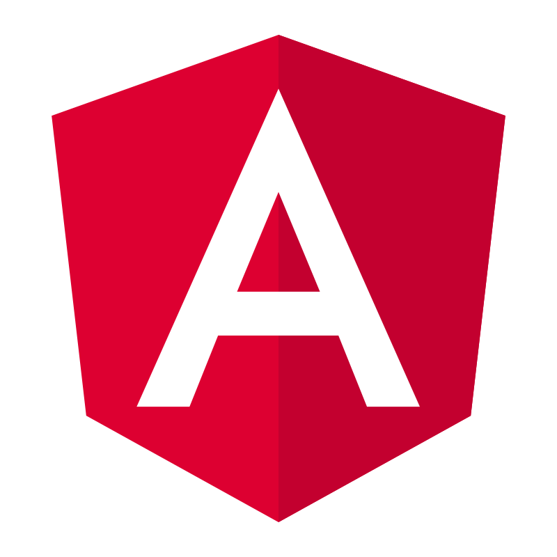
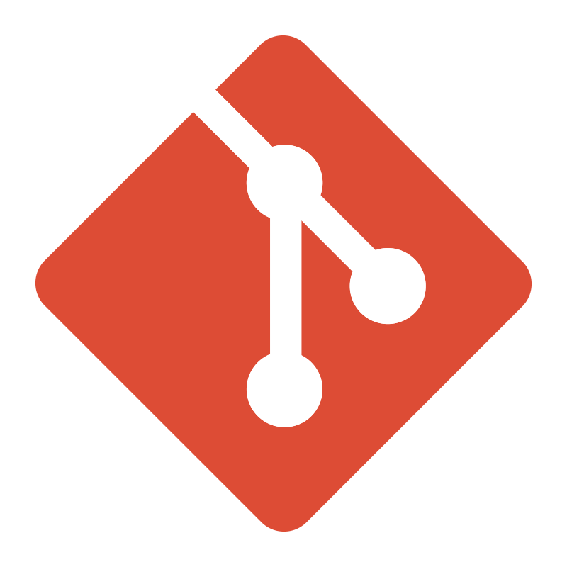
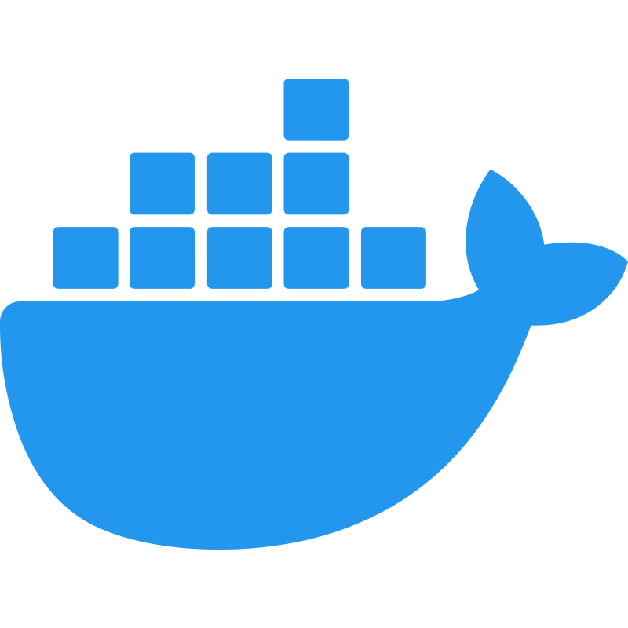
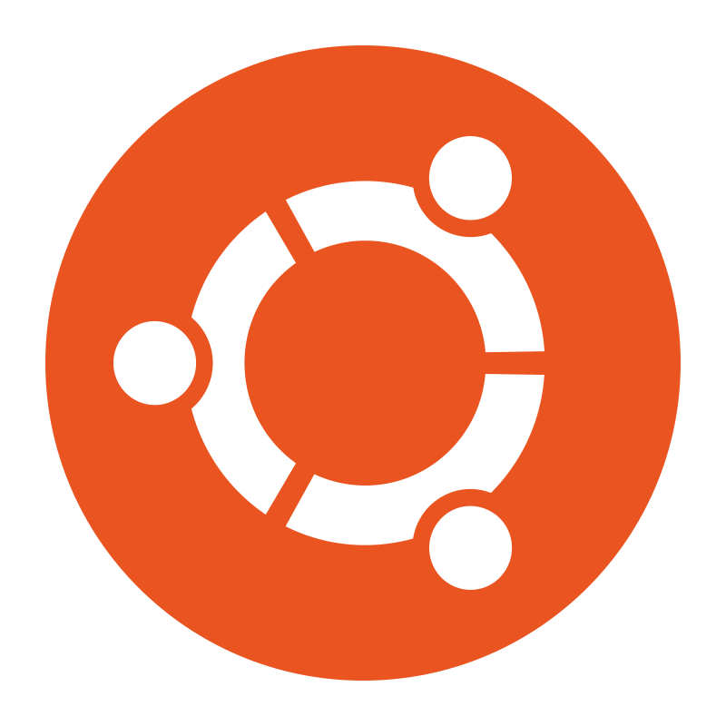
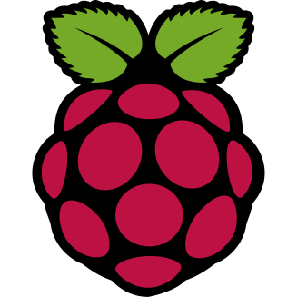
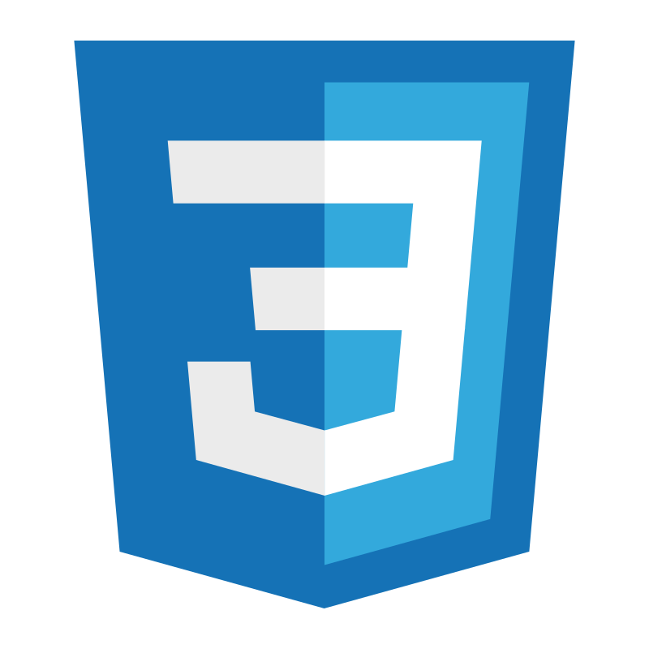

# 𝐻𝑒𝓁𝓁𝑜 𝒲𝑜𝓇𝓁𝒹, 𝐼'𝓂 𝒜𝒽𝓂𝒶𝒹 𝒮𝒶𝒶𝒹𝒶𝓉 👋

### Explore My Activities on Various Online Platforms

---
 
### My Technical Skills and Expertise

---

<!--
**ahmadsaadat1995/ahmadsaadat1995** is a ✨ _special_ ✨ repository because its `README.md` (this file) appears on your GitHub profile.

Here are some ideas to get you started:

- 🔭 I’m currently working on ...
- 🌱 I’m currently learning ...
- 👯 I’m looking to collaborate on ...
- 🤔 I’m looking for help with ...
- 💬 Ask me about ...
- 📫 How to reach me: ...
- 😄 Pronouns: ...
- ⚡ Fun fact: ...
-->
